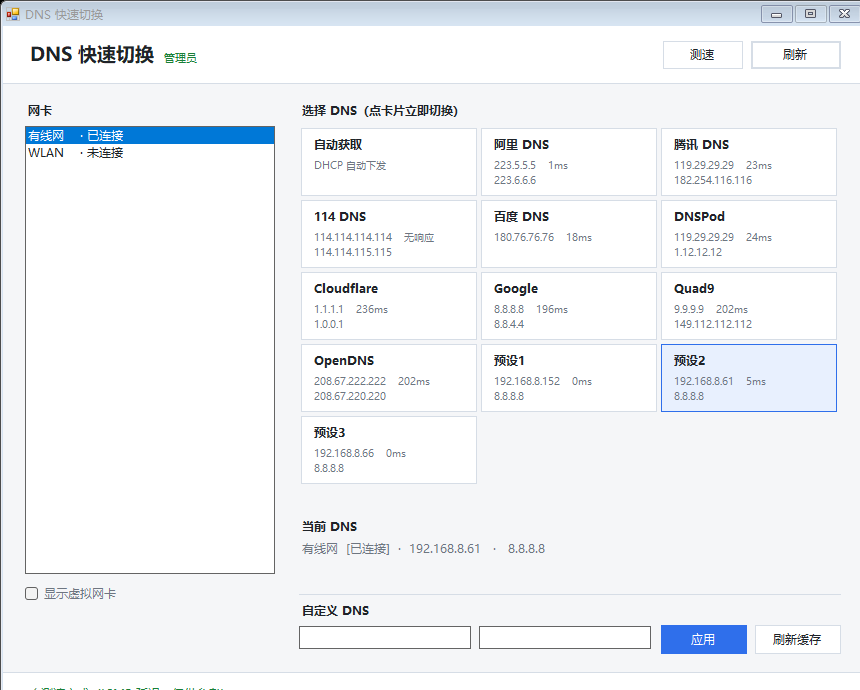

# DNS 快速切换

Windows 网卡 DNS 一键切换工具。单文件、零依赖、自动提权。



---

## 快速开始

双击 **`DNS-Switcher.exe`** → 弹出 UAC 点「是」→ 选网卡 → 点卡片，立即生效。

不需要装任何东西。修改 DNS 必须要有管理员权限，程序会自动申请，不用手动右键「以管理员身份运行」。

---

## 界面说明

| 区域 | 作用 |
| --- | --- |
| 左侧网卡列表 | 选择要操作的网卡。默认只列出物理网卡 |
| 显示虚拟网卡 | 勾选后连同 Tailscale / WSL / VirtualBox / VPN 等一起列出 |
| 右侧卡片区 | **点卡片即切换**。当前正在生效的预设会高亮描边 |
| 测速 | 对每个预设的主 DNS 做一次 ICMP 延迟测试，结果显示在卡片上 |
| 当前 DNS | 显示选中网卡此刻实际使用的 DNS |
| 自定义 DNS | 填写主 / 备用地址后点「应用」 |
| 刷新缓存 | 清空本地 DNS 解析缓存（`Clear-DnsClientCache`） |

---

## 命令行用法

带参数运行 `.ps1` 会走命令行模式，适合脚本化：

```powershell
.\DNS-Switcher.ps1 -List                          # 列出网卡与当前 DNS
.\DNS-Switcher.ps1 -Adapter 有线网 -Preset 阿里     # 切换到某个预设
.\DNS-Switcher.ps1 -Adapter 有线网 -DNS 1.1.1.1,1.0.0.1
.\DNS-Switcher.ps1 -Adapter 有线网 -Auto           # 恢复自动获取
.\DNS-Switcher.ps1 -List -AllAdapters              # 连虚拟网卡一起列出
```

| 参数 | 说明 |
| --- | --- |
| `-Adapter` | 网卡名称，支持模糊匹配 |
| `-Preset` | 预设名称，支持模糊匹配 |
| `-DNS` | 自定义 DNS，逗号分隔 |
| `-Auto` | 恢复 DHCP 自动获取 |
| `-List` | 只列出，不做修改 |
| `-AllAdapters` | 连同虚拟网卡一起显示 |

> 命令行模式请在**管理员终端**里运行，脚本不会为自己提权（避免丢失输出）。

---

## 自定义预设

预设集中在 `DNS-Switcher.ps1` 顶部，加一行就是加一个卡片：

```powershell
$Presets = [ordered]@{
    '自动获取'   = @()
    '阿里 DNS'   = @('223.5.5.5', '223.6.6.6')
    '腾讯 DNS'   = @('119.29.29.29', '182.254.116.116')
    '114 DNS'    = @('114.114.114.114', '114.114.115.115')
    '百度 DNS'   = @('180.76.76.76')
    'DNSPod'     = @('119.29.29.29', '1.12.12.12')
    'Cloudflare' = @('1.1.1.1', '1.0.0.1')
    'Google'     = @('8.8.8.8', '8.8.4.4')
    'Quad9'      = @('9.9.9.9', '149.112.112.112')
    'OpenDNS'    = @('208.67.222.222', '208.67.220.220')
}
```

- 数组里第一个是主 DNS，第二个是备用
- `@()` 表示「自动获取（DHCP）」，对应 `-ResetServerAddresses`
- 字典顺序就是卡片显示顺序

改完重新打包：

```powershell
.\build-exe.ps1
```

---

## 文件说明

| 文件 | 说明 |
| --- | --- |
| `DNS-Switcher.exe` | 主程序，双击运行 |
| `DNS-Switcher.ps1` | 源文件。改预设、改界面都改它 |
| `build-exe.ps1` | 改完源文件后重新打包成 exe |
| `DNS-Switcher.bat` | 备用入口，不想用 exe 时走这个 |
| `DNS-Switcher-预览.png` | 界面截图 |

---

## 实现说明

- **技术栈**：PowerShell 5.1 + WinForms（.NET 自带，无需额外运行时）
- **核心调用**：
  - `Get-NetAdapter` / `Get-DnsClientServerAddress` —— 读网卡、读当前 DNS
  - `Set-DnsClientServerAddress` —— 写 DNS（`-ResetServerAddresses` 恢复 DHCP 下发）
  - `Clear-DnsClientCache` —— 刷新缓存
- **虚拟网卡过滤**：按 `InterfaceDescription` 里的特征词（Hyper-V / Tailscale / VirtualBox / VPN …）过滤，词表在 `$VirtualKeywords`，误伤就往里加删
- **提权**：exe 在 manifest 里声明 `requireAdministrator`；直接跑 `.ps1` 时由脚本自检权限并重启自己
- **打包**：PS2EXE 1.0.18，产物约 63 KB

---

## 已知限制

- 只处理 **IPv4** DNS，不碰 IPv6
- 修改 DNS 必须有管理员权限，UAC 弹窗无法绕过
- 测速基于 **ICMP ping**，部分公共 DNS 禁 ping（如 114）会显示「无响应」，不代表它不可用
- PS2EXE 打包的 exe 在部分杀毒软件上可能被误报（行为模式类似自解压脚本）
- 预设超过 15 个时卡片区会出现滚动条

---

## 重新打包环境

打包依赖 `ps2exe` 模块，已安装在：

```
C:\Users\<用户名>\Documents\WindowsPowerShell\Modules\ps2exe\1.0.18
```

若需在新机器上重建：

```powershell
Install-Module ps2exe -Scope CurrentUser
```

如果 `Install-Module` 报「找不到 PSGallery 存储库」，可以直接下载包再解压：

```powershell
$tmp = "$env:TEMP\ps2exe.zip"
Invoke-WebRequest 'https://www.powershellgallery.com/api/v2/package/ps2exe' -OutFile $tmp
Expand-Archive $tmp "$env:USERPROFILE\Documents\WindowsPowerShell\Modules\ps2exe\1.0.18" -Force
```
